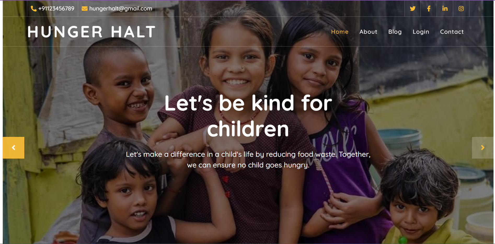

<h1>HUNGER HALT</h1>
<hr>
<h2>Overview</h2>
Food waste and hunger are major global issues. Around one-third of food produced for human consumption is wasted annually, while an estimated 690 million people suffer from hunger daily. These problems are interlinked and require a comprehensive approach.

<h2>What our project does for the same?</h2>
Our project aims to address the issues of food waste and hunger by creating a platform that connects users with NGOs/Retreate centres that are dedicated to feeding the hungry and providing food to those in need. By facilitating these connections, we hope to contribute to the achievement of food security and minimize the problem of food wastage.

Our goals include providing reliable and sustainable food sources to those in need, reducing food waste by channeling it to those who can use it, and raising awareness and encouraging action on the issues of food waste and hunger.

<h2>Video</h2>
[to be added]

<h2>Project Overview</h2>
Home Page- 




About Page-


Login Page-


Registration Page-


NGO Landing Page-


Quality Report Page-


<h2>Key features</h2>
1. A platform for NGOs/Retreate centres dedicated to feeding the hungry and reducing food waste to connect with users who are interested in supporting these causes.

2.  A donation page for users to donate to NGOs that they support.

3. An easy-to-use interface that makes it easy for users to navigate the website and find what they are looking for.

4. Partnerships can be made with local food banks, restaurants, and grocery stores to ensure a steady supply of food for the NGOs.

5. Marketing strategies can be used  to raise awareness about the platform and encourage users to get involved in the fight against food waste and hunger.


<h2>How to Setup</h2>
Clone the repository using 

```
git clone <repository-url>
```

Install dependencies using 
```
npm install
```
Initialize node package manager
```
npm i
```
Run the server using the command 
```
node src/index.js
```
Visit <b>localhost:3000</b> on the browser 
<h2>About us</h2>

Team Members- 

1. Varad Page
2. Suvan Rastogi
3. Nishant Dixit

We are a group of second-year computer science students from Pillai College of Engineering in New Panvel. Our primary interest lies in developing projects that can help solve real-world problems and contribute to society in meaningful ways.

The idea for the Hunger Halt project arose from our realization that food wastage and the number of people who go hungry every day are closely linked. We wanted to do something to address this issue by creating a platform that would enable people to provide food to those in need and contribute to a good cause in their own way.
